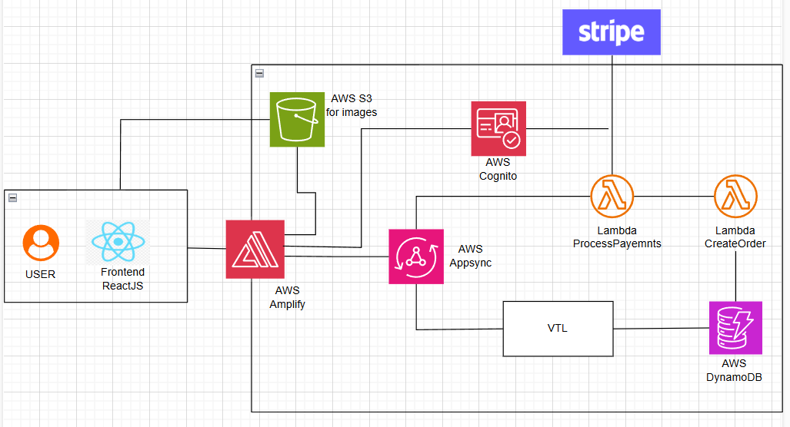

# Online Book Store

## Overview
The **Online Book Store** is a web-based platform where users can browse, search, and purchase books online. It provides user authentication, a shopping cart, and a secure payment system. The platform is built for a seamless experience, leveraging cloud technologies for scalability and reliability.

## Technologies Used

### Frontend
- **ReactJS**
- **TailwindCSS**

### AWS Amplify (Backend & Cloud Services)
AWS Amplify is used to manage backend functionalities such as authentication, API management, and data storage. Below are the AWS services integrated into the project:

- **AWS Cognito (Authentication)**  
  - Manages user authentication and authorization.  
  - Provides secure sign-up, sign-in, and multi-factor authentication (MFA).  

- **AWS AppSync (GraphQL API)**  
  - Enables real-time data synchronization and API queries using GraphQL.  
  - Bridges the frontend and backend for efficient data retrieval and updates.  

- **AWS Lambda (Serverless Functions)**  
  - Handles business logic such as processing orders and handling payments.  
  - Runs event-driven functions in a scalable, cost-effective manner.  

- **AWS DynamoDB (NoSQL Database)**  
  - Stores book listings, user details, orders, and transactions.  
  - Provides fast, scalable, and low-latency data access. 
   
- **AWS S3 (Storage for Book Images)**  
  - Stores book cover images securely.  
  - Provides fast access to images and supports scalable storage solutions.

- **AWS IAM (Access Management)**  
  - Controls access to AWS services securely through roles and policies.  
  - Ensures that only authorized users and applications can interact with backend services.  

## System Architecture  
 

## ER Diagram  
 

## Credits  
Special thanks to [@yash-73](https://github.com/yash-73) for contributions and support in building this project.

           